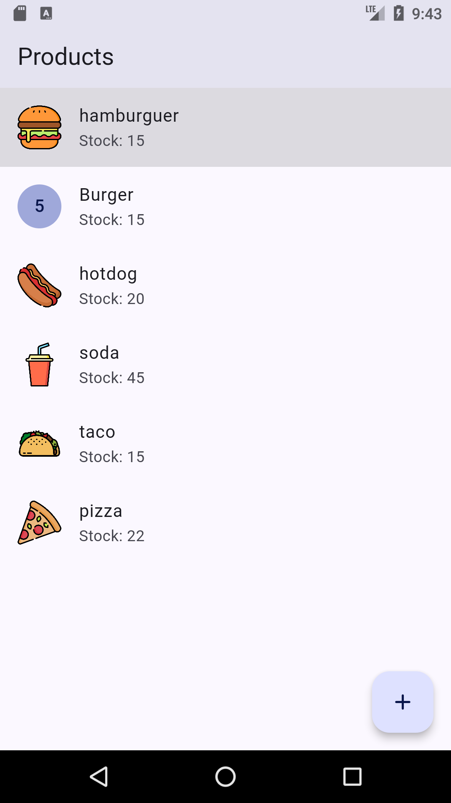
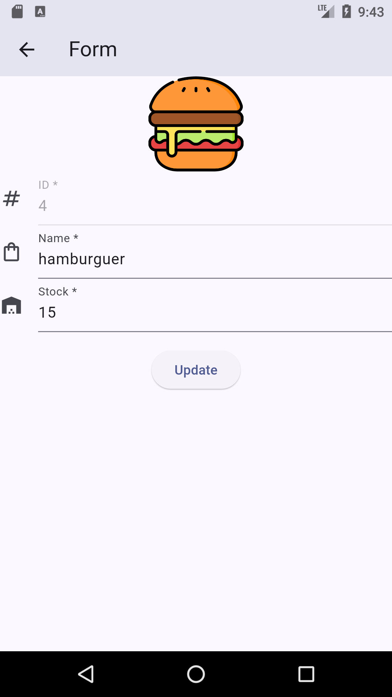
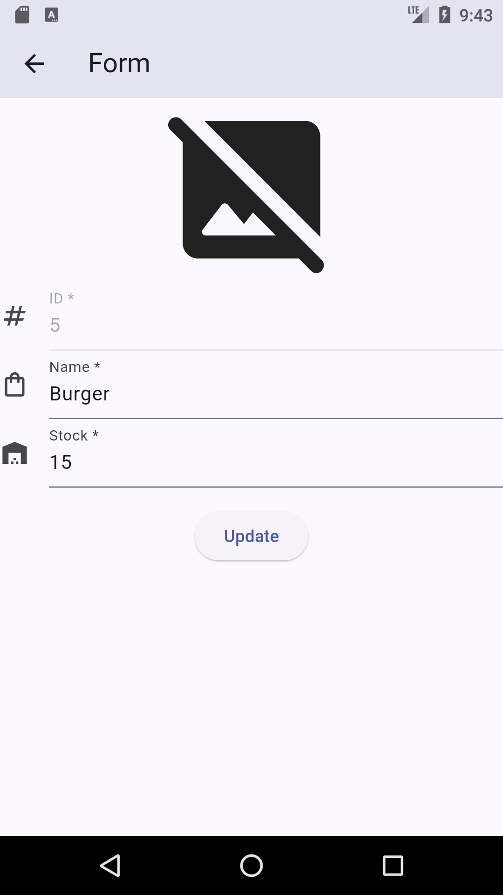

# Product list 📝

Project that show a product list, on this app we can add, update, delete and list products.

I used SQLite by data persist, based on [flutter documentation](https://docs.flutter.dev/cookbook/persistence/sqlite#1-add-the-dependencies "Link to example") and [video](https://www.youtube.com/watch?v=LLYoryuCOlM&list=PLAMfQH2NKM_sm2RZz_IWOGGRpTihdujgq&index=17 "Link to video") by **Luis Serrano Donaire**.

In addition, the app have a form validation for the register of new products and it uses an object with images of possible products.

## Goals 🎯

- Data persist with [SQLite](https://www.sqlite.org/docs.html "Doc about SQLite"). 📊
- [CRUD's](https://www.freecodecamp.org/news/crud-operations-explained/ "Explanation about CRUD"). 📝
- [Navigation](https://docs.flutter.dev/cookbook/navigation/navigation-basics "Doc about Navigator widget") between screens and pass data each one. 🚢

## Widgets 🔎

- [ListView](https://api.flutter.dev/flutter/widgets/ListView-class.html "Doc about ListView widget")
- [Dismissible](https://api.flutter.dev/flutter/widgets/Dismissible-class.html "Doc about Dismissible widget")
- [TextEditingController](https://api.flutter.dev/flutter/widgets/TextEditingController-class.html "Doc about TextEditingController")
- [TextFormField](https://api.flutter.dev/flutter/material/TextFormField-class.html "Doc about TextFormField")
- [InputDecoration](https://api.flutter.dev/flutter/material/TextFormField-class.html "Doc about InputDecoration")

## Demo app 📱

    
    
    

    https://github.com/Riableo/stock1/assets/62998301/caa89e60-3c06-476c-8208-e07babc6ffa1

